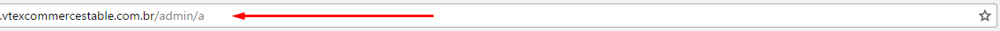
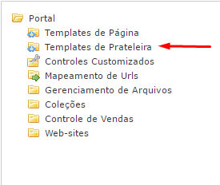
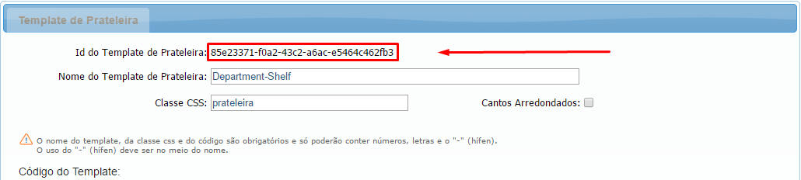

<!-- Generated by documentation.js. Update this documentation by updating the source code. -->

## vtexCustomAutoComplete

This function listen the event of the input and handles the auto complete resquest at any vtex based e-commerce.

**Parameters**

-   `options` **[object](https://developer.mozilla.org/en-US/docs/Web/JavaScript/Reference/Global_Objects/Object)** an object is required by parameter with the followings keys and content:
    -   `options.shelfId` **[string](https://developer.mozilla.org/en-US/docs/Web/JavaScript/Reference/Global_Objects/String)** the hash id of the shelf that should be rendered
    -   `options.appendTo` **jQuery** a jQuery object of the container where the results will be placed
    -   `options.notFound` **[function](https://developer.mozilla.org/en-US/docs/Web/JavaScript/Reference/Statements/function)** a callback function that returns a valid html text or an jQuery object, this result will be appended into the container when no results returns from the search
    -   `options.limit` **[number](https://developer.mozilla.org/en-US/docs/Web/JavaScript/Reference/Global_Objects/Number)** the number of the itens that should be placed at once

## 

## Getting started

-   First find the `shelfId` at vtex `admin/a` -> `template de prateleiras`
    
    
    
    Than call the vtexCustomAutoComplete on your input by following the example bellow

**Examples**

```javascript
$('#myInput').vtexCustomAutoComplete({
  shelfId: '37a38486-2baa-4df1-9b0e-02f96f08fa73',
  appendTo: $('#results'),
  notFound: function(){ return 'not found' },
  limit: 3
});
```
